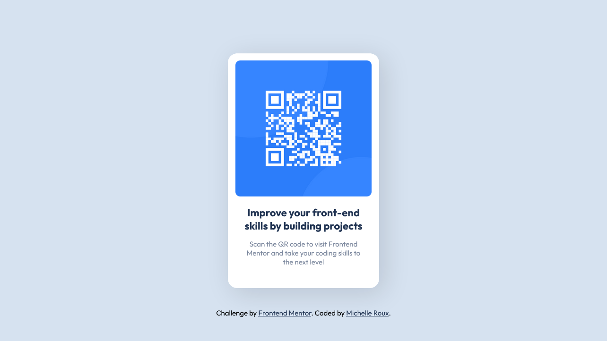

# Frontend Mentor - QR code component solution

This is a solution to the [QR code component challenge on Frontend Mentor](https://www.frontendmentor.io/challenges/qr-code-component-iux_sIO_H). Frontend Mentor challenges help you improve your coding skills by building realistic projects. 

## Table of contents

- [Overview](#overview)
  - [Screenshot](#screenshot)
  - [Links](#links)
- [My process](#my-process)
  - [Built with](#built-with)
  - [What I learned](#what-i-learned)
  - [Continued development](#continued-development)
- [Author](#author)
- [Acknowledgments](#acknowledgments)

## Overview

### Screenshot

### Links

- Solution URL: [Click here](https://your-solution-url.com)
- Live Site URL: [Click here](https://mcdulingm.github.io/qr-code-component/)

## My process

I start with establishing the parameters of the projects like colors and sizes and then I move to setting my sections in HTML. I end off with connecting style with structure. I also focused on working from the mobile view to desktop

### Built with

- HTML
- CSS custom properties
- SCSS
- Flexbox
- Mobile-first workflow

### What I learned

Not much, it's more trying to rememeber a few things since it's been a while working with SCSS.

### Continued development

I need to spend more time studying the ins and outs of SCSS.

## Author

- Frontend Mentor - [@mcdulingm](https://www.frontendmentor.io/profile/mcdulingm)

## Acknowledgments

Shout out to the future mentors in my life who will be helping me grow from this first upload.
